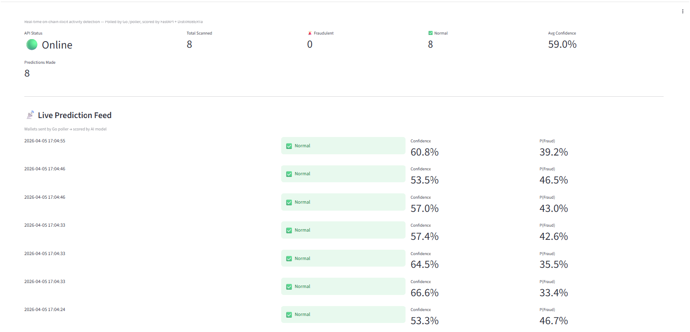
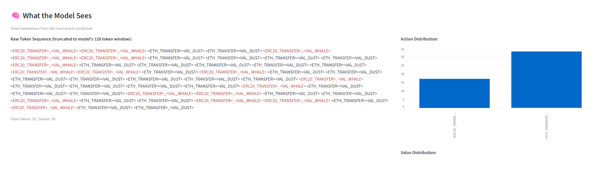

# Wallet Fraud Detection ML (NLP Proof of Concept)

A real-time, on-chain illicit activity detector that treats blockchain transaction histories as a language.

By translating raw hex data and smart contract interactions into an English-based token sequence (e.g., `<TRANSFER> <WHALE> <SWAP>`), this project uses Natural Language Processing (NLP) to classify the behavior of Ethereum wallets. The system monitors live mempools for interactions with mixers, bridges, and DEXes, fetches the sender's history, and scores their risk of being a bad actor.

---

## Dashboard

The Streamlit dashboard shows a live prediction feed with per-wallet confidence scores alongside a token sequence inspector ("What the Model Sees") that displays the raw `<ACTION> <MAGNITUDE>` sequence fed into the model for the most recent prediction.

---

## How It Works

Traditional fraud detection relies on hardcoded heuristics. This project instead treats wallet transaction history as a language - using NLP to understand the context and flow of behavior over time.

- **Dataset:** 26 known Tornado Cash-linked wallets via Dune Analytics, alongside 26 normal baseline wallets sourced from high-volume Uniswap activity
- **Behavioral Sequencing:** Last 50 transactions per wallet via the Etherscan API - enough context to capture a full "Prep to Action to Exit" flow
- **Custom Tokenizer:** Translates raw EVM data into `<ACTION> <MAGNITUDE>` tag sequences, deliberately abstracted away from exact numbers to avoid overfitting
  - Example: `<APPROVAL> <ERC20> <SWAP> <DEX> <OUTFLOW_LARGE>`
- **Model:** Fine-tuned DistilRoBERTa sequence classifier (Hugging Face)

> **PoC Disclaimer:** With only 52 training samples, the model currently performs near chance. The real contribution is the tokenization schema and live pipeline architecture, both designed to scale. A production version would require a dataset orders of magnitude larger.

---

## Dataset and Feature Design

| Feature | Data Source | Rationale |
|---|---|---|
| Malicious Labels | Dune (Tornado Cash) | Known users of obfuscation protocols |
| Normal Labels | Dune (Uniswap) | High-volume, non-malicious DeFi activity |
| Transaction Depth | Etherscan (50 txs) | Enough context to see Prep to Action to Exit flow |
| Tokens/Tags | Custom Logic | Simplified `<ACTION> <MAGNITUDE>` to avoid overfitting on exact numbers |

---

## What the Model Currently Detects

The model is trained to recognize behavioral patterns associated with money laundering - specifically wallets that follow the classic obfuscation cycle of depositing funds into a mixer, bridging across chains, and exiting via a DEX.

---

## Architecture

    Ethereum (Alchemy RPC)
            |
            v
    +--------------+    +-------------------+    +--------------+
    |  Go Poller   |--->|  FastAPI          |--->|  Streamlit   |
    |  /poller     |    |  + Model          |    |  Dashboard   |
    |              |    |  (DistilRoBERTa)  |    |              |
    +--------------+    +-------------------+    +--------------+
      Polls blocks        Tokenizes txs &          Visualizes
      every 12s           scores via /predict      live stream

- **Go Poller:** Highly concurrent service that watches the latest Ethereum blocks. When a transaction hits a monitored contract (like a mixer or bridge), it fetches the sender's history and fires it to the API.
- **FastAPI Backend:** Receives the transaction history, runs the custom tokenizer, and feeds the sequence into the fine-tuned DistilRoBERTa model to return a "Fraudulent" or "Normal" classification with a confidence score.
- **Streamlit Dashboard:** A live, real-time UI showing prediction feeds, rolling averages, and a manual testing sandbox.

---

## Monitored Contracts

| Category | Contracts |
|---|---|
| Mixers | Tornado Cash, Railgun |
| L2 Bridges | Wormhole, Hop, zkSync, Base, Optimism, Arbitrum |
| DEXes | Uniswap V2/V3, SushiSwap, 0x, 1inch |

---

## Setup

### 1. Clone and Configure

    git clone https://github.com/YOUR_USERNAME/wallet-fraud-detection-ml.git
    cd wallet-fraud-detection-ml
    cp .env.example .env
    # Edit .env with your Alchemy and Etherscan API keys

### 2. Python Environment

    python -m venv venv
    source venv/bin/activate  # Linux/macOS
    # .\venv\Scripts\activate # Windows
    pip install torch transformers datasets fastapi uvicorn streamlit requests pandas accelerate

### 3. Generate Data and Train (Optional)

    cd model_trainer
    python get_etherscan_data.py   # Collects last 50 txs for the wallets
    python tokenize_data.py        # Converts hex into text sequences
    python train_data.py           # Fine-tunes DistilRoBERTa
    cd ..

### 4. Run the Pipeline (3 terminals)

**Terminal 1 - API:**
    
    uvicorn fast_api:app --reload

**Terminal 2 - Go Poller:**
    
    export ALCHEMY_API_KEY="your_key_here"
    cd poller && go run main.go

**Terminal 3 - Dashboard:**
    
    streamlit run dashboard.py

Open http://localhost:8501 in your browser.

---

## Tech Stack

| Layer | Technology |
|---|---|
| Machine Learning | PyTorch, Hugging Face Transformers (DistilRoBERTa) |
| Data Engineering | Dune Analytics, Etherscan API, Custom Python Tokenizer |
| Backend | FastAPI, Python |
| Infrastructure | Go (Golang), Alchemy Web3 RPC |
| Frontend | Streamlit |

---

## Roadmap

- **Expand the malicious dataset:** The current labels are sourced exclusively from Tornado Cash. Adding Railgun (ZK-privacy protocol) and THORChain (cross-chain exits) would capture the obfuscation methods preferred by modern exploiters.
- **Phishing dump detection:** Add feature engineering to flag "fence" behavior - wallets that swap 10 or more unrelated tokens within a short window, a pattern distinct from laundering but equally indicative of a bad actor offloading stolen assets.
- **Dataset scale:** Expand from 52 wallets to thousands using automated labeling pipelines and on-chain ground truth sources.
- **Tokenizer refinement:** Extend the token vocabulary to cover more contract types, MEV patterns, and cross-chain behavior.
- **Graph modeling:** Explore graph neural networks to capture wallet-to-wallet relationship patterns that sequential models miss.
- **Production hardening:** Replace the Streamlit dashboard with a proper alerting pipeline and persistent scoring database.

### Unsupervised Anomaly Detection (Long-term)

The labeled approach has a fundamental ceiling - it can only detect behavior it has seen before. The long-term goal is an autoencoder trained exclusively on normal wallet sequences. By learning to reconstruct normal behavior, the model flags anomalies by reconstruction error alone, with no labels required. This would catch novel attack patterns the supervised model has no reference for.

Candidate features for the anomaly detection layer:

- Time-delta between transactions (rapid bursts vs. organic cadence)
- Token diversity ratio (number of unique tokens touched per session)
- Contract novelty score (interactions with contracts less than N days old)
- Gas price deviation from wallet's own historical baseline
- Inflow/outflow asymmetry over rolling windows
- Bridge hop count within a 24-hour window
- Dormancy breaks (wallet inactive for 90+ days suddenly moves large value)
- Circular flow detection (funds returning to origin address within N hops)
- Interaction with contracts that have no verified source code
- Session length distribution (number of txs per active period over wallet lifetime)
